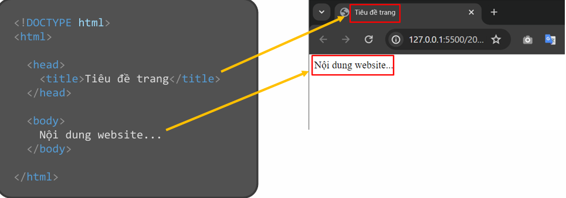

### *HTML-Hyper Text Markup Language:* Là ngôn ngữ đánh dấu siêu văn bản. HTML có tác dụng tạo bộ khung xương cho trang web.
 
# Một chương trình cơ bản của HTML

**Thường bao gồm:** các thành phần cốt lõi để hiển thị nội dung trên trình duyệt. Nó bao gồm cấu trúc trang HTML cơ bản, 
các thẻ để hiển thị văn bản, hình ảnh, liên kết, và khả năng kết hợp với CSS và JavaScript để định dạng và thêm tính năng

**Một cấu trúc của file HTML:**



Trong đó:
 - `<!DOCTYPE html>` (document type: html): để khai báo cho trình duyệt biết đây là kiểu tài liệu HTML.
 - `<html>`: Thẻ html để khởi tạo khung trang web.
 - `<head>`: Chứa các thông tin chung của trang web.
 - `<title>`: Nằm bên trong thẻ <head>, dùng để khai báo tiêu đề của trang  
 - `<body>`: Tất cả nội dung hiển thị trên website đều viết trong thẻ body

# Một số thẻ cơ bản
* `<h1>` đến `<h3>`: Tiêu đề các phần nội dung.
* `<p>`: Đoạn văn bản.
* `<a>`: Liên kết đến email.
* ``: Hiển thị hình ảnh.
* `<ul>` và `<li>`: Danh sách không thứ tự (sở thích).
* `<ol>` và `<li>`: Danh sách có thứ tự (kỹ năng).
* `<table>`: Bảng thông tin.
* `<strong>` và `<em>`: Định dạng chữ (in đậm và in nghiêng).
# 1. `<html>`, `<head>`, `<title>`, `<body>`
## Cú pháp
```html
<html>
  <head>
    <title>Tiêu đề trang</title>
  </head>
  <body>
    Nội dung trang
  </body>
</html>
```
## Ví dụ:
```html
<html>
  <head>
    <title>Trang web của Khang</title>
  </head>
  <body>
    <p>Chào mừng bạn đến với trang web của tôi!</p>
  </body>
</html>
```
# 2. `<h1>` đến `<h3>`
## Cú pháp:
```html
<h1>Tiêu đề chính</h1>
<h2>Tiêu đề phụ</h2>
<h3>Tiêu đề nhỏ</h3>
```
## Ví dụ:
```html
<h1>Nguyễn Hữu Khang</h1>
<h2>Thông tin cá nhân</h2>
<h3>Sở thích</h3>
```
# 3. `<p>`
## Cú pháp:
```html 
<p>Nội dung đoạn văn.</p>
```
## Ví dụ:
```html 
<p>Tôi là sinh viên ngành Công nghệ Thông tin tại IUH.</p>
```
# 4. `<a>`
## Cú pháp:
```html
<a href="mailto:email@example.com">Liên hệ qua email</a>
```
## Ví dụ:
```html
<a href="mailto:khang@example.com">Gửi email cho tôi</a>
```
# 5. ``
## Cú pháp:
```html

```
## Ví dụ:
```html

```
# 6. `<ul>` và `<li>` (Danh sách không thứ tự)
## Cú pháp:
```html
<ul>
  <li>Phần tử 1</li>
  <li>Phần tử 2</li>
</ul>
```
## Ví dụ:
```html
<ul>
  <li>Chơi bóng đá</li>
  <li>Chụp ảnh</li>
  <li>Du lịch</li>
</ul>
```
# 7. `<ol>` và `<li>` (Danh sách có thứ tự)
## Cú pháp:
```html
<ol>
  <li>Phần tử 1</li>
  <li>Phần tử 2</li>
</ol>
```
## Ví dụ:
```html
<ol>
  <li>HTML</li>
  <li>CSS</li>
  <li>JavaScript</li>
</ol>
```
# 8. `<table>`
## Cú pháp:
```html
<table>
  <tr>
    <th>Cột 1</th>
    <th>Cột 2</th>
  </tr>
  <tr>
    <td>Giá trị 1</td>
    <td>Giá trị 2</td>
  </tr>
</table>
```
## Ví dụ:
```html
<table border="1">
  <tr>
    <th>Họ tên</th>
    <th>Ngành học</th>
  </tr>
  <tr>
    <td>Nguyễn Hữu Khang</td>
    <td>CNTT</td>
  </tr>
</table>
```
# 9. `<strong>` và `<em>`
## Cú pháp:
```html
<strong>Nội dung in đậm</strong>
<em>Nội dung in nghiêng</em>
```
## Ví dụ:
```html
<p>Tôi là <strong>Nguyễn Hữu Khang</strong>, sinh viên ngành <em>Công nghệ Thông tin</em>.</p>
```
# Thẻ Hình Ảnh trong HTML
### Trong HTML, các thẻ hình ảnh được sử dụng để hiển thị và xử lý nội dung liên quan đến hình ảnh. Dưới đây là danh sách các thẻ phổ biến:
# 1. ``
### Thẻ `` được sử dụng để chèn hình ảnh vào trang web. Đây là một thẻ rỗng (không có thẻ đóng).
## Cú pháp:
<!-- Đây là thẻ chèn hình ảnh -->
```html
  
```
# 2. `<picture>`
### Thẻ `<picture>` được sử dụng để cung cấp nhiều phiên bản của một hình ảnh, tùy thuộc vào kích thước màn hình hoặc điều kiện cụ thể.
## Cú pháp:
```html
<picture>  
  <source srcset="large.jpg" media="(min-width: 800px)">  
  <source srcset="medium.jpg" media="(min-width: 400px)">  
    
</picture>  
```
## Thành phần:
* `<source>`: Cung cấp các hình ảnh thay thế với điều kiện cụ thể (dựa vào media hoặc type).
* ``: Hình ảnh mặc định, được hiển thị nếu không thỏa mãn điều kiện.
# 3. `<figure>` và `<figcaption>`
## Thẻ `<figure>` được sử dụng để nhóm hình ảnh và chú thích của nó. Thẻ `<figcaption>` được sử dụng để thêm mô tả cho hình ảnh.
## Cú pháp:
```html
<figure>  
    
  <figcaption>Bông hoa xinh đẹp</figcaption>  
</figure>
```  
# 4. `<canvas>`
## Thẻ `<canvas>` cho phép vẽ đồ họa, biểu đồ, hoặc hình ảnh động bằng JavaScript.
## Cú pháp:
```html
<canvas id="myCanvas" width="500" height="300"></canvas>
```
## Ví dụ sử dụng với JavaScript:
```javascript
<script>  
  const canvas = document.getElementById('myCanvas');  
  const ctx = canvas.getContext('2d');  
  ctx.fillStyle = 'blue';  
  ctx.fillRect(50, 50, 200, 100);  
</script>
```
# 5. `<svg>`
## Thẻ `<svg>` được sử dụng để vẽ đồ họa vector trong HTML.
## Cú pháp:
```html
<svg width="100" height="100">  
  <circle cx="50" cy="50" r="40" stroke="black" stroke-width="3" fill="red" />  
</svg>  
``` 
# Điểm nổi bật:
* Có thể mở rộng mà không bị giảm chất lượng.
* Hỗ trợ các hình khối như circle, rect, line, v.v.
# Tóm tắt:
| **Thẻ**         | **Mô tả**                                         |
|:----------------|:-------------------------------------------------|
| ``         | Chèn hình ảnh vào trang web.                      |
| `<picture>`     | Cung cấp các phiên bản hình ảnh khác nhau tùy theo điều kiện (ví dụ: độ phân giải màn hình, kích thước). |
| `<figure>`      | Nhóm hình ảnh và chú thích của hình ảnh đó.      |
| `<figcaption>`  | Chú thích cho hình ảnh, được sử dụng cùng với thẻ `<figure>`. |
| `<canvas>`      | Vẽ đồ họa 2D, biểu đồ, hoặc hình ảnh động bằng JavaScript. |
| `<svg>`         | Tạo đồ họa vector (đồ họa có thể thay đổi kích thước mà không bị vỡ hình) trực tiếp trong HTML. |

# Chương trình cơ bản giới thiệu về bản thân:
```html
<!DOCTYPE html>
<html>
<head>
    <title>Giới thiệu bản thân</title>
</head>
<body>
    <h1>Giới thiệu bản thân</h1>
    <h2>Nguyễn Hữu Khang</h2>
    <h3>Thông tin cá nhân</h3>
    <p>Xin chào! Tôi là <strong>Nguyễn Hữu Khang</strong>, hiện đang là sinh viên ngành <em>Công nghệ Thông tin (CNTT)</em> tại <strong>IUH</strong>.</p>
    <p>Tôi yêu thích lập trình và phát triển các ứng dụng web. Đây là một trang web đơn giản giới thiệu về tôi.</p>

    <h3>Sở thích</h3>
    <ul>
        <li>Học lập trình</li>
        <li>Chơi thể thao</li>
        <li>Đọc sách công nghệ</li>
    </ul>

    <h3>Kỹ năng</h3>
    <ol>
        <li>Lập trình web (HTML, CSS, JavaScript)</li>
        <li>Ngôn ngữ C/C++</li>
        <li>Giải thuật và cấu trúc dữ liệu</li>
    </ol>

    <h3>Bảng thông tin</h3>
    <table>
        <tr>
            <th>Thông tin</th>
            <th>Chi tiết</th>
        </tr>
        <tr>
            <td>Họ và tên</td>
            <td>Nguyễn Hữu Khang</td>
        </tr>
        <tr>
            <td>Ngành học</td>
            <td>Công nghệ Thông tin</td>
        </tr>
        <tr>
            <td>Trường</td>
            <td>IUH</td>
        </tr>
    </table>

    <h3>Hình ảnh</h3>
    <p>Dưới đây là một hình ảnh minh họa:</p>
    

    <h3>Liên hệ</h3>
    <p>Bạn có thể liên hệ với tôi qua email: <a href="mailto:khang.nguyen@example.com">khang.nguyen@example.com</a></p>
</body>
</html>
```

# Cách link css 
Có thể liên kết nó bằng cách sử dụng thẻ `<link>` trong phần `<head>` của tệp HTML.

**VD:** ```<link rel="stylesheet" href="path/to/styles.css">```

**Trong đó:**
  - `rel="stylesheet":` Xác định rằng đây là một tệp CSS.
  - `href="path/to/styles.css":` Đường dẫn đến tệp CSS (có thể là đường dẫn tương đối hoặc tuyệt đối). 

**VD minh họa:**

```css
<!DOCTYPE html>
<html lang="en">
<head>
    <meta charset="UTF-8">
    <meta name="viewport" content="width=device-width, initial-scale=1.0">
    <title>Bài tập</title>
    <link rel="stylesheet" href="styles.css">
</head>
<body>
    <h1>Chào mừng!</h1>
    <p>Đây là một ví dụ về cách liên kết CSS.</p>
</body>
</html>
```


**Hoặc có thể sử dụng cách khác:**

```css
<!DOCTYPE html>
<html lang="en">
<head>
    <meta charset="UTF-8">
    <meta name="viewport" content="width=device-width, initial-scale=1.0">
    <title>Bài tập HTML</title>
<style>
    body {
      font-family: Arial, sans-serif;
      background-color: #f4f4f4;
      color: #333;
    }
    h1 {
      color: #0066cc;
    }
</style>
</head>
<body>
    <h1>Chào mừng!</h1>
    <p>Đây là một ví dụ về cách liên kết CSS.</p>
</body>
</html>
```
# Cách link JavaScript
 Tệp JavaScript thường được sử dụng để thêm chức năng động cho trang web. Bạn có thể liên kết nó bằng cách sử dụng thẻ `<script>`.

 **VD:** ```<script src="path/to/script.js"></script>```

 **Trong đó:**
  `src="path/to/script.js"`: Đường dẫn đến tệp JavaScript.

**VD minh họa:**

```javascript
<!DOCTYPE html>
<html lang="en">
<head>
    <meta charset="UTF-8">
    <meta name="viewport" content="width=device-width, initial-scale=1.0">
    <title>Liên kết JavaScript</title>
</head>
<body>
    <h1 id="greeting">Hello!</h1>
    <button id="changeTextBtn">Click Me</button>
    <script src="script.js"></script>
</body>
</html>
```
# Bài tập

## Trắc nghiệm

**1. HTML có phải là ngôn ngữ lập trình không?**  
- a. Có, là ngôn ngữ lập trình  
- b. Không, HTML là ngôn ngữ đánh dấu, được sử dụng để mô tả cấu trúc và bố cục của trang web  

---

**2. Thẻ `<head>` dùng để làm gì?**  
- a. Chứa các thông tin siêu dữ liệu (metadata)  
- b. Chứa nội dung trang web  

---

**3. Cách chèn ảnh nào sau đây là đúng?**  
- a. ``  
- b. `<a href="image.jpg">Mô tả hình ảnh</a>`  

---

**4. Sự khác biệt giữa thẻ `<ul>` và `<ol>` là gì?**  
- a. `<ul>` tạo danh sách không có thứ tự (các dấu chấm), `<ol>` có thứ tự (các số hoặc ký tự).  
- b. `<ol>` tạo danh sách không có thứ tự (các dấu chấm), `<ul>` có thứ tự (các số hoặc ký tự).  

---

**5. Thẻ nào được sử dụng để tạo form?**  
- a.  
    ```html
    <form>
        Họ và tên: 
        <br>
        Tuổi:
    </form>
    ```
- b.  
    ```html
    <table>
        Họ và tên:
        <br> 
        Tuổi:
    </table>
    ```

---

**6. Thẻ `<a>` có tác dụng gì?**  
- a. Được dùng để tạo liên kết  
- b. Được dùng để nhóm các phần tử với nhau  

---

**7. Thẻ `<h1>` nhỏ hơn thẻ `<h3>` đúng không?**  
- a. Có  
- b. Không  

---

**8. Làm thế nào để ngắt dòng trong HTML?**  
- a. `<span>`  
- b. `<br>`  

---

**9. Thẻ nào tạo một nút bấm trong HTML?**  
- a. `<button>`  
- b. `<btn>`  

---

**10. Lỗi sai của đoạn code dưới đây nằm ở dòng nào?**  
```html
1   <!DOCTYPE html>
2   <html lang="en">
3   <head>
4       <title>Trang web cơ bản</title>
5   </head>
6   <body>
7       <h1>Chào mừng đến với trang web của tôi</h1>
8       <p>Đây là một đoạn văn mô tả.<p>
9       
10      <a href="https://example.com">Truy cập trang web</a>
11      <ul>
12          <li>Mục 1</li>
13          <li>Mục 2</li>
14      </ul>
15  </body>
16  </html>
```
---

## Thực hành

### - Tạo một trang web giới thiệu về bản thân
- Yêu cầu:
Hãy tạo một trang web HTML đơn giản với chủ đề "Hành trình học lập trình". Trang web cần sử dụng các thẻ HTML cơ bản dưới đây:
    - `<html>, <head>, <title>, <body>`
    - `<h1> đến <h3>`
    - `<p>, <a>, `
    - `<ul> hoặc <ol>, <li>`
    - `<table>`
    - `<strong>, <em>`
- Hướng dẫn
    - Tạo một tệp có tên **"index.html"**.

    - 
    ``` 
    <!DOCTYPE html>
    <html lang="vi">
    <head>
        <meta charset="UTF-8">
        <meta name="viewport" content="width=device-width, initial-scale=1.0">
        <title>Hành trình học lập trình</title>
    </head>
    <body>
        <!-- Tiêu đề chính -->
        <h1>Hành trình học lập trình</h1>
        
        <!-- Đoạn giới thiệu -->
        <p><strong>Lập trình</strong> là một trong những kỹ năng quan trọng nhất của thế kỷ 21. Bài viết này sẽ chia sẻ về hành trình học lập trình của tôi.</p>
        
        <!-- Các bước học lập trình -->
        <h2>Các bước trong hành trình</h2>
        <ol>
            <li><strong>Tìm hiểu cơ bản:</strong> Học về HTML, CSS và JavaScript để xây dựng trang web.</li>
            <li><strong>Phát triển kỹ năng:</strong> Làm các dự án thực tế để cải thiện khả năng.</li>
            <li><strong>Nâng cao:</strong> Học thêm về các framework như React hoặc Angular.</li>
        </ol>

        <!-- Các ngôn ngữ yêu thích -->
        <h3>Ngôn ngữ lập trình yêu thích</h3>
        <ul>
            <li>Python - dễ học, mạnh mẽ.</li>
            <li>JavaScript - phổ biến trong phát triển web.</li>
            <li>Java - mạnh mẽ và ổn định cho backend.</li>
        </ul>

        <!-- Bảng so sánh ngôn ngữ -->
        <h2>Bảng so sánh ngôn ngữ lập trình</h2>
        <table border="1" cellpadding="5" cellspacing="0">
            <tr>
                <th>Ngôn ngữ</th>
                <th>Ưu điểm</th>
                <th>Ứng dụng</th>
            </tr>
            <tr>
                <td><em>Python</em></td>
                <td>Dễ học, cú pháp gọn gàng</td>
                <td>Khoa học dữ liệu, AI</td>
            </tr>
            <tr>
                <td><em>JavaScript</em></td>
                <td>Chạy trên trình duyệt, năng động</td>
                <td>Phát triển web</td>
            </tr>
            <tr>
                <td><em>Java</em></td>
                <td>Đa nền tảng, hiệu năng cao</td>
                <td>Backend, ứng dụng di động</td>
            </tr>
        </table>

        <!-- Hình ảnh minh họa -->
        <h2>Hình ảnh truyền cảm hứng</h2>
        

        <!-- Liên kết tham khảo -->
        <p>Để học lập trình, bạn có thể tham khảo tài liệu tại <a href="https://www.w3schools.com" target="_blank">W3Schools</a>.</p>

        <!-- Kết luận -->
        <p><strong>Cảm ơn</strong> bạn đã đọc bài viết này. Hy vọng bạn sẽ tìm được nguồn cảm hứng trên hành trình học lập trình!</p>
    </body>
    </html>
    ```
    <br>
- Giải thích:
    - Thẻ `<html>`, `<head>`, `<title>`, `<body>`: Tạo cấu trúc cơ bản cho trang web.
    - Thẻ tiêu đề `<h1>` đến `<h3>`: Dùng để đặt tiêu đề chính và phụ.
    - Thẻ `<p>`, `<a>`, ``: Dùng để tạo đoạn văn, liên kết, và hình ảnh minh họa.
    - Danh sách `<ul>`, `<ol>`, `<li>`: Trình bày danh sách các bước và sở thích.
    - Thẻ `<table>`: Dùng để trình bày bảng so sánh ngôn ngữ lập trình.
    - Nhấn mạnh văn bản `<strong>`, `<em>`: Làm nổi bật thông tin quan trọng.
    <br>
## Đáp án Trắc nghiệm
1. a
2. b
3. a
4. a
5. a
6. a
7. b
8. b
9. a
10. Lỗi sai ở dòng 8 thẻ `<p>` chưa được đóng gây ra lỗi cấu trúc

# * Những lưu ý

1. Cấu trúc cơ bản:
   - Luôn bắt đầu với `<!DOCTYPE html>` (khai báo loại tài liệu HTML)
   - Đảm bảo có thẻ `<html>`, `<head>` (phần đầu) và `<body>` (phần thân)
   - Đóng tất cả các thẻ đúng thứ tự

2. Thẻ Meta và Encoding (Mã hóa ký tự):
   - Nên thêm thẻ meta charset để hiển thị đúng tiếng Việt:
   ```html
   <meta charset="UTF-8">
   ```

3. Đặt tên file và thư mục (File and folder naming):
   - Không sử dụng dấu cách trong tên file (nên dùng dấu gạch ngang)
   - Nên đặt tên file chính là "index.html"
   - Tránh sử dụng ký tự đặc biệt và dấu tiếng Việt trong tên file

4. Hình ảnh và tài nguyên (Images and resources):
   - Nên đặt alt (văn bản thay thế) cho tất cả hình ảnh
   - Chỉ định kích thước cho hình ảnh để tránh layout shift (sự thay đổi bố cục)
   - Đường dẫn (path) tới file ảnh phải chính xác

5. HTML ngữ nghĩa (Semantic HTML):
   - Sử dụng đúng các thẻ semantic như:
     + `<header>` (phần đầu trang)
     + `<nav>` (thanh điều hướng)
     + `<main>` (nội dung chính)
     + `<footer>` (phần chân trang)
   - Không lạm dụng thẻ `<div>` (thẻ phân vùng) khi có thể dùng thẻ semantic phù hợp

6. Định dạng code (Code formatting):
   - Thụt lề code để dễ đọc (indentation)
   - Comment code (chú thích) khi cần thiết
   - Giữ nhất quán trong cách viết (viết thường hoặc hoa)

7. Kiểm tra (Testing):
   - Kiểm tra trang web trên nhiều trình duyệt (cross-browser testing)
   - Validate HTML (kiểm tra tính hợp lệ) bằng công cụ W3C Validator
   - Đảm bảo tất cả liên kết (links) hoạt động

8. SEO cơ bản (Search Engine Optimization - Tối ưu hóa công cụ tìm kiếm):
   - Sử dụng thẻ title (tiêu đề) phù hợp
   - Thêm meta description (mô tả trang web)
   - Sử dụng heading (tiêu đề) (`<h1>` đến `<h6>`) đúng thứ bậc

9. Tối ưu hiệu suất (Performance optimization):
   - Tối ưu kích thước hình ảnh (image optimization)
   - Tải các file CSS (định dạng kiểu) ở `<head>`
   - Tải JavaScript (mã lệnh) ở cuối `<body>`

10. Khả năng truy cập (Accessibility):
    - Sử dụng các thuộc tính ARIA (hỗ trợ người dùng khuyết tật) khi cần thiết
    - Đảm bảo độ tương phản màu sắc (color contrast)
    - Cung cấp thông tin thay thế cho nội dung không phải văn bản (alternative text)
<br>
# Các trang web giúp bạn học tốt HTML
# [W3School](http://https://www.w3schools.com/)

# [F8](http://https://fullstack.edu.vn/)
